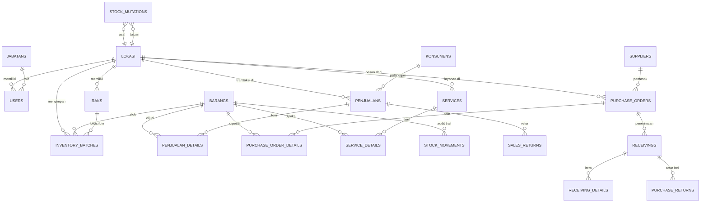
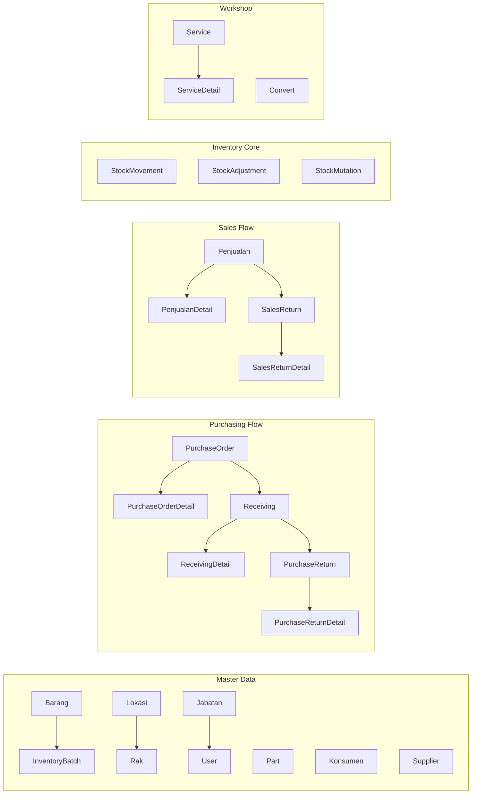
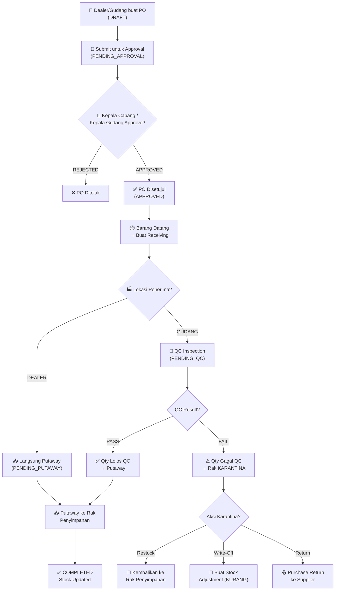
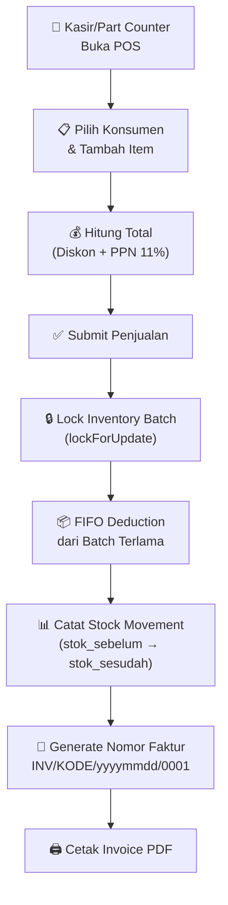
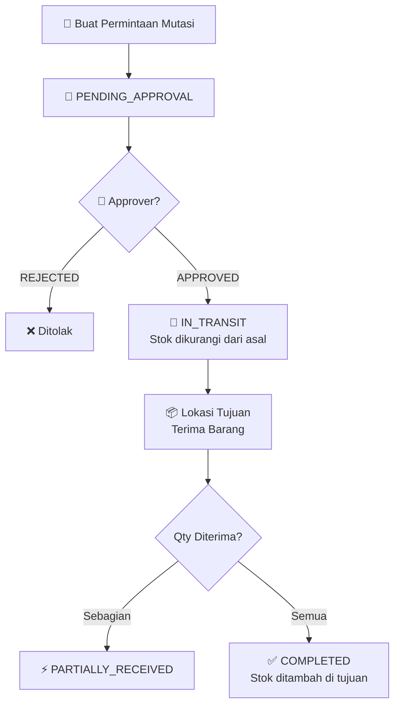
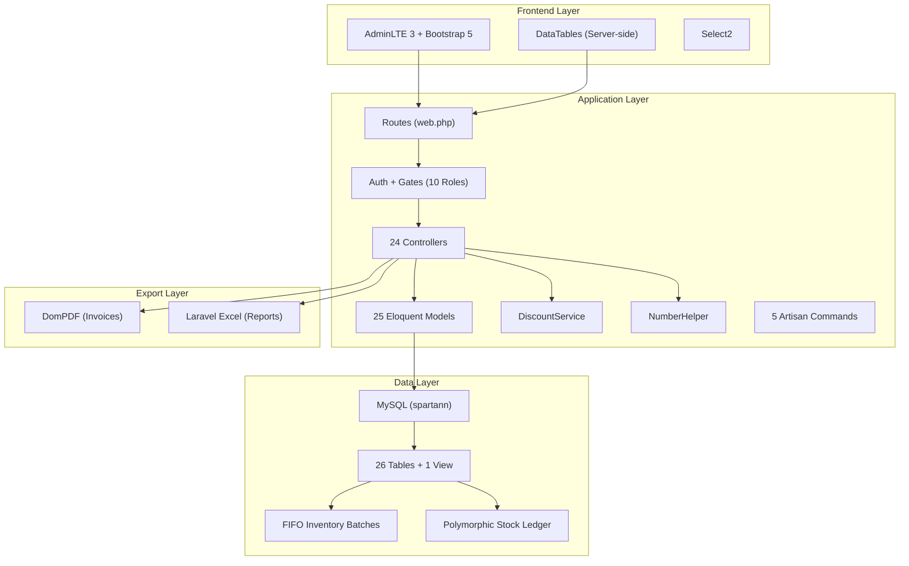

# 🔍 Analisis Komprehensif Proyek SPARTAN

> **SPARTAN LTI** — Sistem Manajemen Sparepart, Inventori & Bengkel untuk Jaringan Dealer Yamaha di Wilayah Lampung

---

## 1. Ringkasan Eksekutif

SPARTAN adalah aplikasi **Enterprise Resource Planning (ERP) skala menengah** yang dibangun khusus untuk mengelola operasi **Main Dealer Yamaha** beserta **34+ cabang dealer** di wilayah Lampung. Sistem ini mencakup modul lengkap mulai dari manajemen inventori sparepart, purchasing, warehouse management (WMS), point-of-sale (POS), workshop/service bengkel, hingga reporting keuangan.

### Statistik Proyek

| Aspek | Detail |
|-------|--------|
| **Framework** | Laravel 8.x (PHP 7.3/8.0) |
| **UI/Dashboard** | AdminLTE 3 + Bootstrap 5 |
| **Database** | MySQL (`spartann`, charset `utf8mb4`) |
| **Total Tabel** | 26 tabel + 1 view |
| **Total Model** | 25 Eloquent models |
| **Total Controller** | 24 controllers (1 base + 1 Home + 22 Admin) |
| **Total Migrasi** | 99 file migrasi (91 batch) |
| **Katalog Part** | 255.000+ item Yamaha Genuine Parts |
| **Cabang Dealer** | 34+ lokasi (Pusat, Gudang, Dealer) |
| **Role Pengguna** | 10 jabatan dengan akses terkontrol |
| **File SQL** | ~25.8 MB |

---

## 2. Tech Stack & Arsitektur

### 2.1 Backend (PHP)

| Package | Versi | Fungsi |
|---------|-------|--------|
| `laravel/framework` | ^8.75 | Core framework |
| `barryvdh/laravel-dompdf` | 1.0 | Cetak PDF faktur & PO |
| `maatwebsite/excel` | ^3.1 | Import/export Excel (parts, service) |
| `yajra/laravel-datatables-oracle` | ^9.21 | Server-side DataTables |
| `laravel/sanctum` | ^2.11 | API authentication |
| `doctrine/dbal` | ^3.10 | Schema modification di migrasi |
| `jeroennoten/laravel-adminlte` | ^3.15 | Admin dashboard template |
| `laravel/ui` | ^3.4 | Auth scaffolding Bootstrap |
| `fruitcake/laravel-cors` | ^2.0 | CORS middleware |
| `guzzlehttp/guzzle` | ^7.0.1 | HTTP client |

### 2.2 Frontend (JS/CSS)

| Package | Versi | Fungsi |
|---------|-------|--------|
| `bootstrap` | ^5.1.3 | CSS framework |
| `laravel-mix` | ^6.0.6 | Asset bundling (Webpack) |
| `axios` | ^0.21 | HTTP client frontend |
| `sass` / `sass-loader` | ^1.32 / ^11.0 | SCSS compilation |
| `@popperjs/core` | ^2.10.2 | Tooltips/popovers |

### 2.3 Environment

```
APP_NAME=Laravel  |  APP_ENV=local  |  APP_DEBUG=true
APP_URL=http://192.168.81.15/spartann
DB_DATABASE=spartann  |  DB_USERNAME=root  |  DB_PASSWORD=(kosong)
TIMEZONE=Asia/Jakarta
```

> [!WARNING]
> **Security Concern**: Database menggunakan `root` tanpa password dan `APP_DEBUG=true`. Ini hanya aman untuk environment development/lokal.

---

## 3. Arsitektur Database (26 Tabel + 1 View)

### 3.1 Entity Relationship Diagram



### 3.2 Kategorisasi Tabel

#### 📦 Master Data (6 tabel)

| Tabel | Fungsi | Key Columns |
|-------|--------|-------------|
| `barangs` | Master item Non-YGP dengan harga bertingkat | `part_code` (UNIQUE), `selling_in`, `selling_out`, `retail` |
| `parts` | Katalog YGP (255.000+ item Yamaha) | `kode_part` (UNIQUE), `cost`, `retail` |
| `lokasi` | Lokasi (PUSAT/DEALER/GUDANG) — 34+ cabang | `tipe` (enum), `kode_lokasi`, hierarki: `koadmin`, `asd`, `aom`, `asm`, `gm` |
| `jabatans` | Master jabatan (10 role) | `nama_jabatan`, `singkatan` |
| `konsumens` | Master pelanggan (BENGKEL/RETAIL) | `kode_konsumen`, `tipe_konsumen` |
| `suppliers` | Master pemasok/vendor | `kode_supplier`, `pic_nama` |

#### 🏭 Warehouse & Inventory (4 tabel)

| Tabel | Fungsi | Key Columns |
|-------|--------|-------------|
| `raks` | Rak gudang format Zona-Rak-Level-Bin (e.g. `A-R01-L1-B01`) | `tipe_rak` (PENYIMPANAN/KARANTINA) |
| `inventory_batches` | Stok aktual per barang per rak per lokasi (FIFO) | `barang_id`, `rak_id`, `lokasi_id`, `quantity` |
| `stock_movements` | Audit trail pergerakan stok (polymorphic ledger) | `stok_sebelum`, `stok_sesudah`, `referensi_type` |
| `stock_adjustments` | Penyesuaian stok dengan approval workflow | `tipe` (TAMBAH/KURANG), `status` (PENDING/APPROVED/REJECTED) |

#### 🛒 Purchasing & Receiving (6 tabel)

| Tabel | Fungsi |
|-------|--------|
| `purchase_orders` | Header PO (Supplier PO / Dealer Request) dengan approval 2 level |
| `purchase_order_details` | Detail item PO: `qty_pesan`, `qty_disetujui`, `qty_diterima` |
| `receivings` | Penerimaan barang dari PO (QC → Putaway flow) |
| `receiving_details` | Detail penerimaan: `qty_terima`, `qty_lolos_qc`, `qty_gagal_qc` |
| `purchase_returns` | Retur pembelian ke supplier |
| `purchase_return_details` | Detail item retur beli |

#### 💰 Sales & POS (4 tabel)

| Tabel | Fungsi |
|-------|--------|
| `penjualans` | Header faktur penjualan (POS) dengan diskon & PPN |
| `penjualan_details` | Detail item penjualan: `qty_jual`, `harga_jual`, `harga_modal` (HPP) |
| `sales_returns` | Retur penjualan dari pelanggan |
| `sales_return_details` | Detail item retur jual |

#### 🔧 Workshop / Bengkel (2 tabel)

| Tabel | Fungsi |
|-------|--------|
| `services` | Invoice servis bengkel (data kendaraan, teknisi, breakdown biaya) |
| `service_details` | Detail servis: `item_category` (JASA/PART/OLI/LAINNYA) |

#### 🔄 Transfer & Utility (4 tabel)

| Tabel | Fungsi |
|-------|--------|
| `stock_mutations` | Transfer stok antar-lokasi dengan approval workflow |
| `converts_main` | Mapping job bundling ke part code |
| `users` | Akun pengguna terkait lokasi & jabatan |
| `migrations` | Laravel migration log |

#### 👁️ View (1)

| View | Fungsi |
|------|--------|
| `converts` | JOIN `converts_main` ↔ `barangs` untuk menampilkan detail part dari job bundling |

---

## 4. Arsitektur Aplikasi (MVC)

### 4.1 Model Layer (25 Models)

Semua model terletak di `app/Models/` dengan pola konsisten:



#### Fitur Model Utama:

| Model | Fitur Kunci |
|-------|-------------|
| `Barang` | `getTotalStockAttribute()` — computed total stock, `getStockByLokasi()` — stock per cabang, `scopeActive()` |
| `Penjualan` | `generateNomorFaktur($lokasiId)` — format `INV/{kodeDealer}/ymd/0001` (reset harian per cabang) |
| `PurchaseOrder` | `syncStatus()` — auto-update status berdasarkan qty diterima |
| `Receiving` | `generateReceivingNumber()`, `getStatusBadgeAttribute()` — HTML badge accessor |
| `StockMutation` | `generateNomorMutasi()` — format `MT-YYYYMMDD-0001` |
| `SalesReturn` | `generateReturnNumber()` — format `RTJ/YYYYMMDD/0001` |
| `PurchaseReturn` | `generateReturnNumber()` — format `RTB/YYYYMMDD/0001` |
| `Rak` | Auto-format `kode_rak` via boot method: `{ZONA}-{RAK}-{LEVEL}-{BIN}` |
| `User` | Role helpers: `isGlobal()`, `isPusat()`, `isGudang()`, `isDealer()`, `hasRole()` |

### 4.2 Controller Layer (24 Controllers)

#### Modul Transaksi Utama:

| Controller | Fungsi | Highlight |
|------------|--------|-----------|
| `PenjualanController` | POS retail checkout | **Pessimistic locking** (`lockForUpdate()`) + FIFO batch deduction |
| `PurchaseOrderController` | Supplier PO & Dealer Request | **Dual-type PO** + 2-level approval |
| `ReceivingController` | Penerimaan barang | Auto-routing: Gudang → QC, Dealer → langsung Putaway |
| `QcController` | Quality Control | Pass → Putaway, Fail → Karantina |
| `PutawayController` | Simpan ke rak | Transfer dari staging ke rak penyimpanan |
| `QuarantineStockController` | Manajemen karantina | Restock (backdating FIFO) atau Write-Off |
| `ServiceController` | Workshop bengkel | Excel import harian, deduction sparepart otomatis |
| `StockMutationController` | Transfer antar-cabang | Approval → IN_TRANSIT → Partial/Full receiving |
| `StockAdjustmentController` | Penyesuaian stok | TAMBAH/KURANG dengan approval workflow |
| `SalesReturnController` | Retur penjualan | Barang retur masuk ke rak karantina |
| `PurchaseReturnController` | Retur pembelian | Return dari rak karantina ke supplier |

#### Modul Master Data:

| Controller | Fungsi |
|------------|--------|
| `BarangController` | CRUD item Non-YGP + price visibility per role |
| `PartController` | CRUD katalog YGP + Excel import/export |
| `LokasiController` | CRUD lokasi + hierarki manajemen |
| `RakController` | CRUD rak + auto-generate kode |
| `JabatanController` | CRUD jabatan + validasi user terikat |
| `SupplierController` | CRUD supplier/vendor |
| `UserController` | CRUD user + assignment role & lokasi |
| `ConvertController` | CRUD mapping job → part code |
| `ProfileController` | Update profil & password |

#### Modul Reporting & Utility:

| Controller | Fungsi |
|------------|--------|
| `ReportController` | Stock Card, Stock by Location, Total Stock, Sales Journal, Purchase Journal, Inventory Value, Sales Summary, Service Summary + Excel export |
| `PdfController` | Cetak PDF landscape (24cm × 14cm) untuk PO & Sales Invoice |

### 4.3 Services & Helpers

| File | Fungsi |
|------|--------|
| [DiscountService.php](file:///c:/laragon/www/spartann/app/Services/DiscountService.php) | Kalkulasi diskon kampanye promosi & kategori pelanggan |
| [NumberHelper.php](file:///c:/laragon/www/spartann/app/Helpers/NumberHelper.php) | `terbilang($nilai)` — konversi angka ke kata Indonesia untuk kwitansi |

### 4.4 Console Commands (Scheduled Tasks)

| Command | Jadwal | Fungsi |
|---------|--------|--------|
| `campaigns:deactivate` | Daily | Nonaktifkan kampanye yang sudah kedaluwarsa |
| `DebugKsgAnalysis` | Manual | Audit invoice deduction KSG (Gratis Service) |
| `DebugServiceAnalysis` | Manual | Deteksi paket non-KSG yang salah tag |
| `FixStockHistory` | Manual | Rebuild running balance `stock_movements` & sinkronisasi `inventory_batches` |
| `RecalculateAveragePurchasePrice` | Manual | Hitung ulang rata-rata harga beli berdasarkan history receiving |

---

## 5. Sistem Otorisasi & Role Management

### 5.1 Struktur 10 Jabatan

| Singkatan | Jabatan | Level Akses | Cakupan |
|-----------|---------|-------------|---------|
| **SA** | Super Admin | Global | Semua modul, semua lokasi |
| **PIC** | Person In Charge | Global | Manajemen area, approval |
| **ASD** | Area Service Development | Global | Monitoring service bengkel |
| **IMS** | Inventory MD | Pusat | Master data & inventory pusat |
| **ACC** | Accounting MD | Pusat | Laporan keuangan & jurnal |
| **KG** | Kepala Gudang | Gudang | Receiving, QC, Putaway, Mutasi |
| **AG** | Admin Gudang | Gudang | Operasional gudang |
| **KC** | Kepala Cabang | Dealer | Approval PO & adjustment cabang |
| **PC** | Part Counter | Dealer | POS penjualan & stok cabang |
| **KSR** | Kasir | Dealer | Kasir POS |

### 5.2 Matrix Akses Gate

| Modul | SA | PIC | ASD | IMS | ACC | KG | AG | KC | PC | KSR |
|-------|:--:|:---:|:---:|:---:|:---:|:--:|:--:|:--:|:--:|:---:|
| Master Barang | ✅ | ✅ | | ✅ | | | | | | |
| Master Lokasi | ✅ | | | | | | | | | |
| Purchasing | ✅ | ✅ | | ✅ | | ✅ | ✅ | ✅ | ✅ | |
| Receiving | ✅ | | | | | ✅ | ✅ | ✅ | ✅ | |
| QC & Putaway | ✅ | | | | | ✅ | ✅ | | | |
| Karantina | ✅ | | | ✅ | | ✅ | ✅ | | | |
| Stock Adjustment | ✅ | ✅ | | ✅ | | ✅ | ✅ | ✅ | ✅ | |
| Stock Mutation | ✅ | ✅ | | ✅ | | ✅ | ✅ | ✅ | ✅ | |
| POS Sales | ✅ | | | | | | | ✅ | ✅ | ✅ |
| Service Bengkel | ✅ | ✅ | ✅ | | | | | ✅ | | |
| Reports | ✅ | ✅ | ✅ | ✅ | ✅ | ✅ | | ✅ | | |

---

## 6. Business Workflow (Alur Bisnis)

### 6.1 Alur Purchasing → Receiving → Putaway



### 6.2 Alur POS Sales (Penjualan)



### 6.3 Alur Stock Mutation (Transfer Antar Cabang)



---

## 7. Fitur Teknis Unggulan

### 7.1 FIFO Inventory dengan Pessimistic Locking

```php
// PenjualanController - Transaksi POS
DB::transaction(function() {
    $batches = InventoryBatch::where('barang_id', $item->barang_id)
        ->where('lokasi_id', $lokasiId)
        ->where('quantity', '>', 0)
        ->orderBy('created_at', 'asc')  // FIFO: ambil batch terlama
        ->lockForUpdate()               // Pessimistic lock
        ->get();
    // Deduct dari batch secara berurutan...
});
```

> [!IMPORTANT]
> Penggunaan `lockForUpdate()` mencegah **race condition** saat multiple kasir melakukan transaksi secara bersamaan pada item yang sama.

### 7.2 Polymorphic Stock Movement Ledger

Setiap pergerakan stok tercatat lengkap dengan snapshot sebelum/sesudah:

```
referensi_type: App\Models\Penjualan    → Penjualan mengurangi stok
referensi_type: App\Models\Service      → Service bengkel mengurangi stok
referensi_type: App\Models\StockAdjustment → Adjustment manual
referensi_type: App\Models\Receiving    → Penerimaan menambah stok
```

### 7.3 Dual Part Catalog Strategy

| Aspek | `barangs` (Non-YGP) | `parts` (YGP) |
|-------|---------------------|----------------|
| Jumlah | Ratusan item | 255.000+ item |
| Pricing | 3-tier: `selling_in`, `selling_out`, `retail` | 2-tier: `cost`, `retail` |
| Inventory | Tracked via `inventory_batches` | Legacy `qty_stok` field |
| Penggunaan | Transaksi POS & Gudang | Referensi katalog & Service |

### 7.4 Auto-Generated Document Numbers

| Dokumen | Format | Contoh |
|---------|--------|--------|
| Faktur Penjualan | `INV/{kode_dealer}/{yyyymmdd}/{seq}` | `INV/LKD/20260724/0001` |
| Nomor Mutasi | `MT-{YYYYMMDD}-{seq}` | `MT-20260724-0001` |
| Retur Penjualan | `RTJ/{YYYYMMDD}/{seq}` | `RTJ/20260724/0001` |
| Retur Pembelian | `RTB/{YYYYMMDD}/{seq}` | `RTB/20260724/0001` |
| Nomor Penerimaan | Auto-generated | Sequential |

### 7.5 Role-Specific Dashboards

Setiap jabatan mendapatkan dashboard yang disesuaikan:

| Role | Dashboard Content |
|------|-------------------|
| Super Admin | Overview semua KPI + pending approvals |
| ASD | Monitoring service bengkel |
| IMS | Status inventory & purchase |
| Accounting | Jurnal & laporan keuangan |
| Kepala Gudang | Receiving, QC, Putaway queue |
| Kepala Cabang | Performa cabang + approval queue |
| Part Counter | Stok tersedia & POS shortcut |
| Kasir | POS quick access |

---

## 8. Reporting & Export

| Laporan | Format | Deskripsi |
|---------|--------|-----------|
| Stock Card | Web + Excel | Kartu stok per barang (in/out/balance) |
| Stock by Location | Web + Excel | Stok per lokasi/cabang |
| Total Stock | Web + Excel | Rekapitulasi stok keseluruhan |
| Sales Journal | Web + Excel | Jurnal penjualan per periode |
| Purchase Journal | Web + Excel | Jurnal pembelian per periode |
| Inventory Value | Web + Excel | Nilai inventori (HPP) |
| Sales Summary | Web + Excel | Ringkasan penjualan |
| Service Summary | Web + Excel | Ringkasan service bengkel |
| PO Invoice | PDF (24×14cm) | Cetak PO landscape |
| Sales Invoice | PDF (24×14cm) | Cetak faktur penjualan landscape |

---

## 9. Views & UI Structure

### 9.1 Layout

- **Template**: AdminLTE 3 dengan branding SPARTAN (`img/SPARTAN.png`)
- **Sidebar**: Menu dinamis berdasarkan Gate permissions per role
- **Plugins**: DataTables, Select2, BsCustomFileInput

### 9.2 Blade Templates (26 modul)

| Kategori | Modul Views |
|----------|-------------|
| **Master Data** | `barangs`, `parts`, `converts`, `jabatans`, `lokasi`, `raks`, `suppliers`, `users` |
| **Purchasing** | `purchase_orders` |
| **Warehouse** | `receivings`, `qc`, `putaway`, `quarantine_stock` |
| **Inventory** | `stock_adjustments`, `stock_mutations`, `mutation_receiving` |
| **Sales** | `penjualans`, `sales_returns`, `purchase_returns` |
| **Workshop** | `services` |
| **Reports** | `reports` |
| **User** | `profile` |
| **Dashboards** | 11 role-specific views (`_superadmin`, `_asd`, `_ims`, `_accounting`, `_pic`, `_approver`, `_kepala_cabang`, `_admin_gudang`, `_operator`, `_kasir`, `_default`) |

---

## 10. Evaluasi & Temuan

### ✅ Kekuatan (Strengths)

| # | Aspek | Detail |
|---|-------|--------|
| 1 | **Arsitektur Inventory Solid** | FIFO batch-level tracking dengan pessimistic locking mencegah race condition |
| 2 | **Audit Trail Lengkap** | Polymorphic `stock_movements` mencatat setiap perubahan stok dengan snapshot before/after |
| 3 | **Role-Based Access Control Granular** | 10 role dengan Gate permissions yang sangat spesifik per modul |
| 4 | **Workflow QC/Karantina** | Pemisahan rak PENYIMPANAN vs KARANTINA dengan workflow terstruktur |
| 5 | **Multi-Branch Support** | Mendukung 34+ cabang dengan hierarki manajemen yang jelas |
| 6 | **Comprehensive Reporting** | 8+ jenis laporan dengan export Excel |
| 7 | **Dual PO System** | Dealer Request vs Supplier PO dengan approval terpisah |

### ⚠️ Area Perbaikan (Improvement Areas)

| # | Aspek | Detail | Rekomendasi |
|---|-------|--------|-------------|
| 1 | **Dual Part Table** | `barangs` dan `parts` mengelola item terpisah, potensi data inconsistency | Pertimbangkan unifikasi dengan flag `is_ygp` |
| 2 | **Fat Controllers** | Beberapa controller (terutama `PenjualanController`, `PurchaseOrderController`) mengandung business logic kompleks | Extract ke Service classes |
| 3 | **Tidak Ada Soft Delete** | Model menggunakan `is_active` flag manual, bukan Laravel SoftDeletes | Implementasi `SoftDeletes` trait |
| 4 | **Minim Unit Test** | Hanya ada Example tests bawaan Laravel | Tambah feature & unit tests untuk workflow kritis |
| 5 | **No Caching** | Query berulang untuk dashboard & reports tanpa cache | Implementasi Redis/cache untuk query berat |
| 6 | **No Queue** | `QUEUE_CONNECTION=sync` — semua proses dijalankan synchronous | Gunakan queue untuk Excel import/export & PDF generation |
| 7 | **Security** | Root tanpa password, debug mode aktif, tidak ada rate limiting | Hardening untuk production |
| 8 | **No API Documentation** | Route API ada tapi belum terdokumentasi | Implementasi Swagger/OpenAPI |
| 9 | **README Default** | Masih menggunakan README bawaan Laravel | Tulis dokumentasi proyek yang proper |

---

## 11. Ringkasan Arsitektur



> [!NOTE]
> SPARTAN adalah sistem ERP yang cukup matang dan komprehensif untuk skala operasi dealer otomotif regional. Arsitektur inventory-nya (FIFO + pessimistic locking + polymorphic audit trail) menunjukkan pemahaman yang baik tentang kebutuhan warehouse management. Area utama untuk peningkatan adalah pada **separation of concerns** (memindahkan business logic dari controller ke service layer), **testing coverage**, dan **production hardening**.
